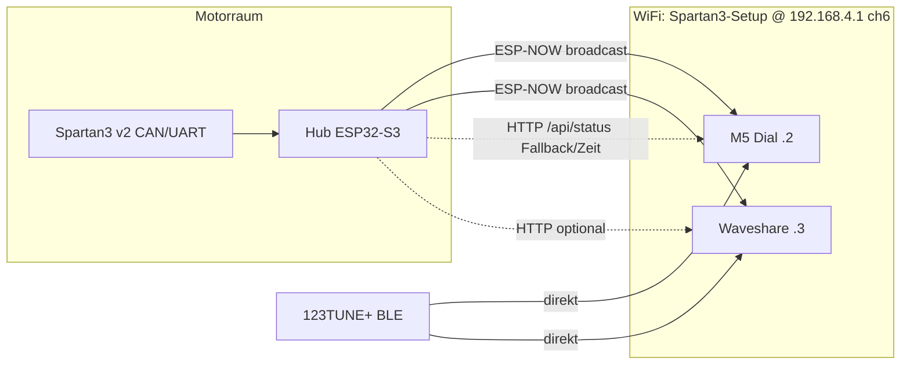

# CODEX Handoff — Spartan Bus-Cockpit (Hub + M5 Dial + Waveshare 2.8″)

> **Master-Dokument:** `waveshare-vdo-clock/CODEX-HANDOFF.md`  
> Kopie im Hub: `spartan3v2-can-adapter/docs/CODEX-HANDOFF.md` (Verweis auf dieses Dokument)  
> Stand: 2026-06-14 — Branch-Commits siehe Abschnitt [Git-Status](#git-status-2026-06-14)

---

## Projektziel & Architektur

**Ziel:** Unterwegs stabile Live-Anzeige (Lambda, RPM, MAP, ADV) im Bus ohne BLE-/WiFi-Konflikte zwischen drei ESP32-Geräten.

**Fahrt-Setup (Soll):**

| Rolle | Gerät | Primärdaten | Sekundär |
|-------|-------|-------------|----------|
| Motorraum / CAN | Hub (`Spartan3-Hub`) | CAN/UART Spartan λ, optional 123TUNE/BM6 BLE | ESP-NOW Broadcast (λ + RPM/MAP aus Hub-Frame) |
| Cockpit 1 | M5 Dial | **123TUNE+ BLE direkt** (RPM/MAP stabil) | ESP-NOW λ vom Hub |
| Cockpit 2 | Waveshare 2.8″ | **123TUNE+ BLE direkt** | ESP-NOW λ vom Hub; HTTP Hub nur Status/Zeit (optional) |

**Nicht stapeln während der Fahrt:** Hub-BLE-Client (123/BM6) **+** Display-BLE **+** gleichzeitiger HTTP-Voll-Poll auf allen Displays. Hub-BLE bleibt in Fahrt **AUS** (NVS-Default).



ASCII (vereinfacht):

```
Spartan3 v2 ──CAN/UART──► Hub ──ESP-NOW ch6──► M5 + Waveshare (Lambda)
                              │
123TUNE+ ◄──── BLE direkt ────┴──► M5 + Waveshare (RPM/MAP/ADV)
```

Gemeinsamer Binary-Frame: `include/spartan_cockpit_frame.h` (Magic `0x53`, 14 Bytes, CRC8).

---

## Hardware-Matrix

| Gerät | Repo | Branch | PlatformIO Env | COM | GitHub |
|-------|------|--------|----------------|-----|--------|
| Hub Motorraum | `D:\_claude\spartan3v2-can-adapter` | `work` | `motorraum_s3_devkitc` | COM16 | [spartan3v2-can-adapter](https://github.com/niedi74/spartan3v2-can-adapter) |
| M5 Stack Dial | `D:\_claude\M5stack\m5stack-123` | `feature/spartan-live-display` | `m5stack-stamps3` | COM4 | [m5stack-123](https://github.com/niedi74/m5stack-123) |
| Waveshare 2.8″ | `D:\_claude\waveshare-vdo-clock` | `cursor/webgui-ota-c56e` | `waveshare_s3_28c` | COM13 | [waveshare-vdo-clock](https://github.com/niedi74/waveshare-vdo-clock) |

### Netzwerk-Profile (Bus)

| SSID | Passwort | Hub IP | M5 IP | Waveshare IP | WebGUI |
|------|----------|--------|-------|--------------|--------|
| `Spartan3-Setup` | `lambda123` | 192.168.4.1 | 192.168.4.2 | 192.168.4.3 | Hub: `http://192.168.4.1/` · M5: `http://192.168.4.2/` · WS: `http://192.168.4.3/` |

Weitere Profile (Home/Phone): siehe `waveshare-vdo-clock/docs/WLAN-MATRIX.md`.

**Setup-APs (nicht Bus):**

- Waveshare standalone: `VDO-Clock-Setup` / `vdoclock` @ 192.168.4.1 (DHCP)
- M5 Standalone-Setup: `M5Dial-123-Setup` (DHCP @ .1 laut M5-WebGUI-Hinweis)

---

## Feature-Matrix (runtime togglebar)

### Hub (`src/main.cpp`, NVS + WebGUI Setup „Funktionen An/Aus“)

| Feature | Default Fahrt | NVS | WebGUI POST | Serial |
|---------|---------------|-----|-------------|--------|
| ESP-NOW Broadcast | **AN** | `hf_espnow` | `espnow` | `hub feat espnow on\|off` |
| ESP-NOW Kanal | Auto/6/11 | `espnow_ch` | `espnow_ch` | `hub feat espnow ch 0\|6\|11` |
| SoftAP Spartan3-Setup | **AN** | `hf_ap` | `ap` | `hub feat ap on\|off` |
| WLAN STA (Home/Phone) | **AN** (wenn SSID gespeichert) | `hf_wifi` | `wifi` | `hub feat wifi on\|off` |
| CSV Drive-Log | **AN** | `hf_log` | `log` | `hub feat log on\|off` |
| 123TUNE BLE Client | **AUS** | `hf_ble123` | `ble123` | `hub feat ble123 on\|off` |
| BM6 BLE Client | **AUS** | `hf_blebm6` | `blebm6` | `hub feat blebm6 on\|off` |

Live-Tab zeigt Status-Badges (`featEspnow`, `featAp`, `featWifi`, `featBle123`, `featBleBm6`, `featLog`).

`/state` und `/api/status` liefern zusätzlich: `hub_feat_*`, `esp_now_*`, `time_epoch`, `ntp_synced`, Lambda/CAN/123/BM6-Felder.

### M5 Dial (`feature/spartan-live-display`)

| Feature | Default (ui_ver ≥ 6) | NVS | UI | WebGUI |
|---------|----------------------|-----|-----|--------|
| Verbindungsmodus | **CONN_DIRECT_123** | `conn_mode` | Settings CONN | `/ui` `connection` |
| ESP-NOW Lambda | **AN** | `espnow_on` | SET2 „ESP-NOW“ | `/ui` `esp_now` |
| ESP-NOW Kanal | Auto/6/11 | `espnow_ch` | SET2 „ESPN ch“ | `/ui` `esp_now_ch` |
| WiFi Home+AP | AUS | `wifi_apsta` | SET2 | `/ui` `wifi_home_ap` |
| Startseite Fahrt | Lambda | — | `PAGE_LAMBDA` | — |

Gateway-Modus (`CONN_SPARTAN_GATEWAY`) + HTTP `/api/status`-Poll nur für Debug/Home — **nicht** Bus-Fahrtprofil.

### Waveshare 2.8″ (`cursor/webgui-ota-c56e`)

| Feature | Bus-Fahrtprofil | NVS | Touch Setup | WebGUI |
|---------|-----------------|-----|-------------|--------|
| WiFi STA | AN (Spartan3-Setup) | `feat_wifi` | Setup | `/features` |
| BLE Client | **AN** (123 direkt) | `feat_ble` | Setup | `/features` |
| Datenpfad | **BLE** (`data_path=1`) | `data_path` | Setup / Bus-Karte | `/source` |
| BLE-Modus | **direct_123** | `ble_mode` | Setup | `/ble/mode` |
| ESP-NOW | **AN** | `feat_espnow` | Setup | `/features` `espnow` |
| ESP-NOW Kanal | Auto/6/11 | `espnow_ch` | Setup | `/features` `espnow_ch` |
| Hub HTTP Poll | **AUS** (weil `data_path=BLE`) | — | — | — |
| Buzzer | AUS | `feat_buzzer` | Setup | `/features` |

`applyBusProfile()` in `src/main.cpp` setzt Bus-Profil atomar (WiFi Spartan3-Setup, `.3`, BLE 123 direkt, ESP-NOW AN).

---

## NVS / Preferences Keys

### Hub — Namespace `net`

| Key | Typ | Bedeutung |
|-----|-----|-----------|
| `hf_ver` | u8 | Feature-Schema (1) |
| `hf_espnow`, `hf_ap`, `hf_wifi`, `hf_log`, `hf_ble123`, `hf_blebm6` | bool | Feature-Toggles |
| `espnow_ch` | u8 | 0=Auto (folgt STA), 6=Bus, 11=Handy |
| `ssid`, `pass` | string | Home/Phone WLAN |
| `tz_idx` | u8 | Zeitzone |
| `log_cols` | u16 | CSV-Spaltenmaske |
| `tune_mac`, `bm6_mac`, `bm6_aux_mac` | string | BLE-Ziele |
| `dev_sec`, `eng_sec`, `sns_sec` | u64 | Betriebsstunden |

### M5 — Namespace `net`

| Key | Typ | Bedeutung |
|-----|-----|-----------|
| `ui_ver` | u8 | 6 = Fahrt-Defaults |
| `conn_mode` | u8 | 0=direct 123, 1=Spartan gateway |
| `espnow_on`, `espnow_ch` | bool/u8 | ESP-NOW |
| `wifi_prof`, `ssid`, `pass`, `static`, `ip`, `gw`, … | — | WLAN-Profile |
| `buzzer`, `beep_*`, `touch_nav`, `bat_hold`, `wifi_apsta` | bool | UI |
| `bright`, `rot_q` | u8 | Display |

### Waveshare — Namespace `clock`

| Key | Typ | Bedeutung |
|-----|-----|-----------|
| `feat_wifi`, `feat_ble`, `feat_buzzer`, `feat_espnow` | bool | Features |
| `espnow_ch` | u8 | ESP-NOW Kanal |
| `data_path` | u8 | 0=WiFi Hub poll, 1=BLE |
| `ble_mode` | u8 | Hub-BLE vs 123 direkt |
| `ble_mac_123`, `ble_mac_hub`, `ble_addr_123` | string/u8 | BLE-Adressen |
| `hub_host` | string | z.B. `192.168.4.1` |
| `wifi_prof`, `wifi_ap_only` | u8/bool | WLAN |
| `scale`, `dial_off_*`, `bright`, `rot_deg`, `tz_idx`, `motor_style`, `rpm_red` | — | UI/Uhr |

WiFi-Credentials: `src/wifi_secret.h` (gitignored) — Vorlage `src/wifi_secret.example.h`.

---

## WebGUI Endpoints & Serial-Befehle

### Hub @ 192.168.4.1

| Methode | Pfad | Zweck |
|---------|------|-------|
| GET | `/`, `/state`, `/api/status` | Live JSON |
| POST | `/hub_features` | Feature-Toggles |
| POST | `/wifi`, `/wifi_clear` | STA speichern/löschen |
| POST | `/timezone`, `/ntp_sync` | Zeit |
| POST | `/log_columns`, `/clear` | CSV-Log |
| GET | `/download`, `/download_old` | CSV-Dateien |
| GET | `/log/events`, `/log/events.csv` | Event-Ring |
| POST | `/ble_target`, `/bm6_target`, `/uart_cmd`, … | Diagnose/Setup |

**Serial (115200, COM16):**

```
hub feat status
hub feat espnow on|off
hub feat espnow ch 0|6|11
hub feat ap on|off
hub feat wifi on|off
hub feat log on|off
hub feat ble123 on|off
hub feat blebm6 on|off
```

### M5 @ 192.168.4.2

| Methode | Pfad | Zweck |
|---------|------|-------|
| GET | `/`, `/state` | Live UI + JSON |
| POST | `/ui` | Settings (`esp_now`, `esp_now_ch`, `connection`, …) |
| POST | `/wifi_spartan` | Bus-Profil anwenden |
| POST | `/wifi_prof`, `/wifi`, `/wifi_dhcp` | WLAN |
| GET | `/download` | CSV-Log |

### Waveshare @ 192.168.4.3 (Bus) oder DHCP im Home-LAN

| Methode | Pfad | Zweck |
|---------|------|-------|
| GET | `/`, `/api/status` | WebGUI + JSON |
| POST | `/features` | WiFi/BLE/Buzzer/ESP-NOW |
| GET/POST | `/wifi?mode=bus\|home\|ap\|off` | Netzwerk-Modi |
| GET | `/source?mode=wifi\|ble` | Datenpfad |
| GET | `/ble/mode?m=direct\|hub` | BLE-Modus |
| POST | `/update` | OTA |
| GET | `/restart`, `/imu/zero`, `/scan` | Utility |

**Serial (115200, COM13):**

```
bus / bus:on          → applyBusProfile()
espnow:on|off
espnow:ch             → Kanal zyklisch
ble:on|off | ble:123 | ble:hub | ble:scan
wifi:next | wifi:off
buzzer:on|off
rot:+|-|NN | imu:zero | clock
```

---

## Fahrt-Profil Empfehlung (Defaults pro Gerät)

### Vor der Fahrt prüfen

1. **Hub** flashen (`motorraum_s3_devkitc`), WebGUI Setup → Funktionen:
   - ESP-NOW **AN**, Kanal **6** (oder Auto auf Bus-AP)
   - SoftAP **AN**
   - 123 BLE **AUS**, BM6 **AUS**
   - WLAN STA nach Bedarf (NTP über Handy-Hotspot)
   - CSV-Log nach Bedarf
2. **M5:** Bus-Button in WebGUI oder SET2: ESP-NOW **AN**, Kanal **6**, Modus **123 direkt**
3. **Waveshare:** WebGUI „BUS / Spartan3-Setup“ oder Serial `bus:on` — prüfen:
   - `data_path=ble`, `source_mode=direct_123`, `esp_now_enabled=true`
   - COM13 Flash ggf. noch ausstehend (siehe TODOs)

### Erwartetes Laufzeitverhalten Bus

- Alle drei Clients auf `Spartan3-Setup`, Kanal **6**
- Lambda auf Displays aus **ESP-NOW** (`hub_source=espnow`, `esp_now_fresh=true`)
- RPM/MAP auf M5+WS aus **eigener 123-BLE**-Verbindung
- Hub sendet ESP-NOW alle ~100 ms (siehe Hub-Loop)
- **Kein** Hub-123-BLE während Displays verbunden sind

---

## Offene TODOs (priorisiert)

| P | Aufgabe | Repo / Datei |
|---|---------|--------------|
| **P0** | Waveshare auf COM13 flashen und Bus-Profil verifizieren | `pio run -e waveshare_s3_28c -t upload --upload-port COM13` |
| **P1** | Hub-Zeit auf Waveshare ohne HTTP-Poll: optional leichter `time_epoch`-Poll bei `data_path=BLE`, oder NTP über Hub-STA | `waveshare-vdo-clock/src/main.cpp` (`hubWifiPollTick`, `applyBusProfile`) |
| **P1** | End-to-End Test: Hub ESP-NOW TX-Zähler steigt, M5+WS `esp_now_rx`/`esp_now_seq` synchron | alle drei Geräte |
| **P2** | `loadSettings()` Zeile ~3283: bei Bus-SSID wird `data_path` noch auf WiFi Hub gesetzt — mit `applyBusProfile` Boot-Logik abgleichen | `waveshare-vdo-clock/src/main.cpp:3283-3287` |
| **P2** | M5 `applyBusProfile` setzt noch `CONN_SPARTAN_GATEWAY` wenn kein Spartan-Profil in Liste — ggf. auf Direct+ESP-NOW vereinheitlichen | `m5stack-123/src/main.cpp:1148-1163` |
| **P3** | `scripts/analyze_dial_center.py` — commiten oder in `.gitignore` | `waveshare-vdo-clock` |
| **P3** | Hub/M5 Log-Dateien (`*.log`) nicht committen | `.gitignore` ergänzen |

---

## Build / Flash (PowerShell)

### Hub

```powershell
cd D:\_claude\spartan3v2-can-adapter
pio run -e motorraum_s3_devkitc
pio run -e motorraum_s3_devkitc -t upload --upload-port COM16
pio device monitor --port COM16 --baud 115200
```

### M5 Dial

```powershell
cd D:\_claude\M5stack\m5stack-123
pio run -e m5stack-stamps3
pio run -e m5stack-stamps3 -t upload --upload-port COM4
pio device monitor --port COM4 --baud 115200
```

### Waveshare 2.8″

```powershell
cd D:\_claude\waveshare-vdo-clock
# wifi_secret.h aus example anlegen falls fehlt
pio run -e waveshare_s3_28c
pio run -e waveshare_s3_28c -t upload --upload-port COM13
pio device monitor --port COM13 --baud 115200
```

**Hinweis Waveshare-Monitor:** `monitor_rts=0`, `monitor_dtr=0` in `platformio.ini` — Monitor öffnen resettet sonst das Display.

**NimBLE / parallele Builds:** nicht zwei Projekte gleichzeitig auf demselben COM flashen; Windows `ar.exe`-Limit → Waveshare nutzt `lib_archive = no`.

---

## Verify-Checkliste

### 1. Hub `GET http://192.168.4.1/api/status`

Erwartung (Auszug):

```json
"esp_now_ready": true,
"esp_now_channel": 6,
"hub_feat_espnow": true,
"hub_feat_ap": true,
"hub_feat_ble123": false,
"hub_feat_blebm6": false,
"hub_feat_wifi": true,
"hub_feat_log": true,
"lambda": 0.xxx,
"can_ready": true
```

Live-Tab: Badges ESP/AP/WLAN grün, 123/BM6 rot/aus.

### 2. M5 `GET http://192.168.4.2/state`

```json
"connection": 0,
"connection_label": "...direct...",
"esp_now_enabled": true,
"esp_now_fresh": true,
"esp_now_channel": 6,
"esp_now_rx": >0,
"demo": false
```

### 3. Waveshare `GET http://192.168.4.3/api/status`

```json
"data_path": "ble",
"source_mode": "direct_123",
"esp_now_enabled": true,
"esp_now_fresh": true,
"esp_now_channel": 6,
"ble_connected": true,
"hub_source": "espnow"
```

Touch Setup: Zeilen BLE **OK/AN**, ESP-NOW Kanal **6**, Daten **BLE**.

### 4. Kanal-Kohärenz

| Ort | Wert |
|-----|------|
| Hub AP | Kanal 6 |
| Hub `esp_now_channel` | 6 |
| M5/WS `esp_now_channel_pref` | 0 (Auto→6) oder 6 |

Bei Handy-Hotspot-Profil: Kanal **11** überall konsistent setzen.

---

## Bekannte Probleme

| Problem | Ursache | Mitigation |
|---------|---------|------------|
| COM port busy | Monitor/IDE offen | Prozesse schließen, `--upload-port` explizit |
| ESP-NOW `fresh=false` | Kanal-Mismatch (6 vs 11) | Alle Geräte `espnow_ch=6` oder Hub Auto+STA |
| NimBLE connect fail | Hub+Display konkurieren um 123 | Hub `ble123 off`, nur ein Display-BLE aktiv testen |
| Waveshare schwarz nach Monitor | USB-CDC RTS reset | RTS/DTR=0 oder Monitor nicht während Fahrt |
| `ar.exe` / Linker | Große NimBLE-Libs | `lib_archive = no` (Waveshare) |
| M5 WiFi Fahrt AUS | RPM > 650 schaltet Setup-WiFi ab | Erwartetes Verhalten (`disableWifiQuiet`) |
| Waveshare keine Hub-Zeit im Bus-BLE-Modus | `hubWifiPollTick` nur bei `data_path=wifi` | NTP lokal oder TODO P1 |

---

## Git-Status (2026-06-14)

| Repo | Branch | Letzter Commit | Remote | PR vs main |
|------|--------|----------------|--------|------------|
| spartan3v2-can-adapter | `work` | `5fa03ac` Hub WebGUI Fahrt-Features | origin/work synced | PR gegen `main` empfohlen |
| m5stack-123 | `feature/spartan-live-display` | `dc1a0bc` Fahrt 123 BLE + ESP-NOW | origin synced | Feature-Branch |
| waveshare-vdo-clock | `cursor/webgui-ota-c56e` | `1a5d614` Bus Fahrtprofil | origin synced | Cursor-Branch |

**Nicht committen:** `.pio/build/**`, `*.log`, `src/wifi_secret.h`, Build-Artefakte.

---

## Codex — empfohlene nächste Schritte

1. Waveshare flashen (P0) und Checkliste durchgehen.
2. Bei fehlender Uhrzeit im Bus: P1-Zeit-Sync implementieren oder Hub-NTP+STA aktivieren.
3. Drei-Geräte-Fahrttest dokumentieren (Screenshots `/api/status` JSON).
4. PRs für `work` → `main` (Hub) und Feature-Branches reviewen/mergen.
