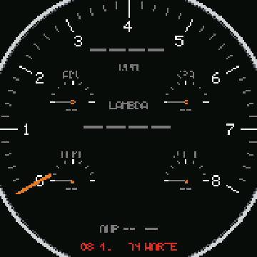
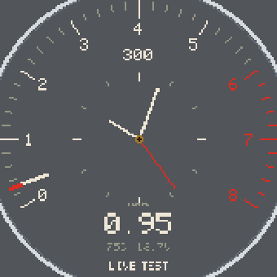
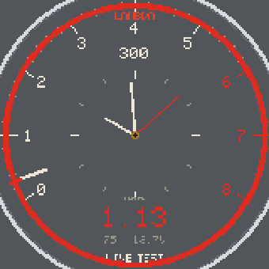
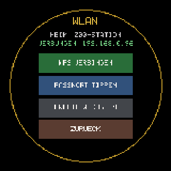

# VDO Quartz-Zeit — Waveshare ESP32-S3 Round LCD

Digitale Nachbildung der **VDO „Quartz-Zeit" Analoguhr** aus dem VW T2b auf einem
runden Touch-Display im Cockpit — plus **Live-Motordaten** vom Spartan3-Hub
(Lambda, Drehzahl, Zündung, Temperatur, Spannung) mit konfigurierbaren **Alarmen**.

| Kombi „123TUNE+" (Test-Hub-Sweep) | Kombi „VDO+UHR" | Alarm-Ring | WLAN-Seite |
|---|---|---|---|
|  |  |  |  |

*(Screenshots live vom Gerät über den `/screen`-Endpoint gezogen.)*

## Hardware

| Komponente | Detail |
|---|---|
| Board | Waveshare **ESP32-S3-Touch-LCD-2.8C** (rund) |
| Display | 2.8" IPS rund, **480×480**, ST7701 (RGB-Parallel-Interface via `esp_lcd`) |
| Touch | **GT911** kapazitiv, I2C (0x5D/0x14) |
| I/O-Expander | **PCA9554** (I2C 0x20): LCD_RST/TP_RST/LCD_CS/SD_CS/Buzzer |
| RTC | PCF85063 (beim Flashen auf PC-Zeit gestellt, `scripts/inject_time.py`) |
| IMU | QMI8658 |
| SD | SD_MMC 1-bit (CLK=2, CMD=1, D0=42; D3 via EXIO4 high) |
| CAN | SN65HVD230 an GPIO43/44 (TWAI, 500k, Cockpit-Frame 0x510) |
| USB | nativ USB-CDC; Auto-Reset nach Flash unzuverlässig → `reboot`-Kommando |
| Board-Akku | MX1.25-LiPo, GPIO4 (ADC1_CH3), Teiler R5/R9 → Vadc=Vbat/3; am USB-Strom unzuverlässig (Ladechip hält Pin nahe Regelspannung) — Anzeige bewusst zurückhaltend |

> ⚠️ **Nicht verwechseln** mit der eckigen `ESP32-S3-Touch-LCD-2.8` (240×320, SPI).
> Dieses Projekt ist die **runde C-Variante** (480×480 RGB). Pins: `docs/PINOUT.md`.

## Software-Stack

- **ESP-IDF `esp_lcd` RGB-Panel** direkt (kein LovyanGFX) + eigener Framebuffer in PSRAM
- **NimBLE-Arduino** — BLE-Fallbacks (Spartan3-Hub, 123TUNE+ direkt)
- **WebServer/HTTPClient** — WebGUI, OTA, Hub-Polling
- PlatformIO (pioarduino, Arduino-Core 3.x), env `waveshare_s3_28c`

## Display-Seiten (Touch)

| # | Seite | Bedienung |
|---|---|---|
| 0 | **Uhr** (VDO-Zifferblatt, skalierbar/rotierbar) | Tap → Menü |
| 1 | Menü | 6 Kacheln |
| 2 | **Motor-Kombi** (6 Stile, s.u.) | Long-Press Mitte → Stil wechseln |
| 3 | Lambda (Gauge ↔ Verlauf, Fenster 60-300 s) | Long-Press Mitte → umschalten, Tap oben → Fenster zyklen |
| 4 | Hub-Status | |
| 5 | Setup | Tap/Long-Press je Zeile |
| 6 | IMU (Neigung) | |
| 7 | Justage (Größe/Rotation) | |
| 10 | On-Screen-Tastatur (WLAN-Passwort) | |
| 11 | WLAN (Tippen/Profil) | |
| 12 | CAN-Status | |
| 13 | CAN-Konfiguration | |

**Kombi-Stile:** `DIGITAL` (bunt, Streifenband) · `VDO` (70er-Look, creme auf grau) ·
`123TUNE+` (schwarz/orange) · `VDO+UHR` (Tacho außen, **Analoguhr** innen) ·
`DIGIFIZ` (Golf-2-Digitaltacho der 80er: Segment-Drehzahlbogen, 7-Segment-Speed,
Temp-Balken, **Ganganzeige** aus Drehzahl÷Speed — Grenzen im Dev-Tab kalibrierbar) ·
`OPEL GSI` (Monza/Kadett-E-Bernstein-Look: gelbe Riesen-Ziffern, rote Warnblöcke live).

**Auto-Cockpit:** Drehzahl > Schwelle (default 600, Dev-Tab) → springt einmal pro
Motorstart automatisch auf die Kombi; Motor 5 s aus → zurück zur Uhr.

## Alarme

Grenzwerte im **Dev-Tab** einstellbar (NVS-persistent). Bei Verletzung blinkt auf
**jeder** Seite ein roter Ring + Grund; Buzzer piept alle 2 s (wenn Feature an).

| Alarm | Default | Bedingung |
|---|---|---|
| λ-Soll-Band | 0.90–1.10 | Motor läuft (≥250/min), λ gültig |
| Drehzahl | > 4500/min | immer |
| Temp (123) | > 90 °C | 123-Daten gültig |
| Spannung | < 11.5 V | Motor läuft |

Das λ-Band färbt auch das grüne Band im Lambda-Verlauf. Tacho-**Redline** und
**Skalenende** sind ebenfalls im Dev-Tab konfigurierbar (wirken auf alle Stile).

## Datenquellen (Priorität)

1. **HTTP-Poll** vom Spartan3-Hub `/api/status` (2 Hz, primär)
   - Hub-AP-Profil: Ziel = Gateway-IP (Subnetz egal)
   - sonst: Profil-Hub-IP (feste IP oder mDNS-Hostname)
2. **CAN** 0x510 (TWAI, listen-only default)
3. **BLE** Spartan3-Hub (optional, `ble:on`)
4. **123TUNE+ direkt** (BLE-NUS-Fallback, `123:on`, nur wenn HTTP/CAN tot)

**Test-Hub-Modus (Dev-Tab):** feste Test-IP übersteuert alles; Quelle heißt dann
sichtbar `TEST` (Display-Statuszeile + WebGUI-Banner). Für Prüfstand-Betrieb im
Heimnetz (z. B. Lambda-Sweep des Test-Hubs) — im Bus wieder ausschalten.

## WLAN

3 Profile (**Heim / Hub-AP / S24**), je mit eigener Hub-IP. **Auto-Fallback**
(default an): Hub-AP > Heim — im Bus hält es immer den Hub. S24 nur manuell.
Setup-AP `VDO-Clock-Setup`/`vdoclock` (192.168.4.1) wenn nichts verbindet.
Profile setzen: WebGUI → WLAN, Serial `wifi:set <slot> <SSID>|<Pass>`, On-Screen-
Tastatur, oder **`wifi.txt` auf der SD** (`<slot>=<SSID>|<Pass>` je Zeile).
Profil-Änderungen werden auf die SD zurückgespiegelt (die Datei ist beim Boot
Master). **Selbstheilung:** Fehlt `SPARTAN3-HUB` nach dem Boot in allen Profilen
(Scan-Tap, Tastatur, kaputte SD-Datei — egal), wird Slot 1 automatisch
wiederhergestellt: das Live-Hub-Profil ist immer wählbar.

## WebGUI (`http://<ip>/`)

| Tab | Inhalt |
|---|---|
| Live | Hub-Werte (aktualisiert sich sekündlich via `/live`), Alarm-Zeile, Seiten-Fernsteuerung |
| **Vorschau** | **Live-Screenshot des Displays** (rundes Canvas, 1,5-s-Refresh solange offen) |
| WLAN | 3 Profile (SSID/Pass/Hub-IP), Profil aktivieren |
| Anzeige | Kombi-Stil, Zifferblatt-Größe (30–150 %), Rotation, Helligkeit |
| IMU | Neigung + Nullung |
| System | Features (WLAN/BLE/Buzzer/123), FW-Stand + Git-Link, OTA-Upload |
| SD | Status + `wifi.txt`-Editor |
| **Dev** | Auto-Cockpit (an/Schwelle), **Test-Hub**, **Alarme** (alle Grenzen), **Tacho** (rot/Skala), **Ganganzeige** (Grenzen gr12/gr23), **Lambda-Verlauf** (Fenster/MAP/Drehzahl-Linie), **Nachtmodus** (Grundhelligkeit), **CAN** (an/aus, Modus, ID, Bitrate) |

### HTTP-Endpoints

| Endpoint | Funktion |
|---|---|
| `/version` | JSON: FW/Git/Features/Alarme/Anzeige/SD/Heap |
| `/live` | JSON: aktuelle Cockpit-Werte + Alarm (für Live-Tab) |
| `/screen` | Roh-RGB565 160×160 (Display-Screenshot, ~50 KB) |
| `/imu` | JSON: aktuelle IMU-Rohwerte (Neigung) |
| `/log` | SD-Systemlog, `?d=JJJJMMTT` für ein bestimmtes Datum |
| `/set`, `/features`, `/wifi`, `/page`, `/sd`, `/sdwifi` | Konfiguration |
| `/update` | OTA (multipart POST, `curl -F firmware=@firmware.bin`) |

## Build & Flash

```bash
pio run -e waveshare_s3_28c                          # bauen
pio run -e waveshare_s3_28c -t upload --upload-port COM25   # USB
curl -F "firmware=@.pio/build/waveshare_s3_28c/firmware.bin" http://<ip>/update  # OTA
```

- **OTA immer auf die direkte IP** — `vdo-clock.local` kann per mDNS auf den
  SoftAP (192.168.4.1) flappen.
- **OTA-Recovery ohne WLAN:** `update.bin` auf die SD legen → wird beim Boot
  geflasht (→ `update.done`/`update.bad`).
- `scripts/inject_time.py` injiziert Build-Zeit (RTC) + Git-Hash (WebGUI-Link).

### Serial-Kommandos (115200)

`wifi:show` · `wifi:set <slot> <SSID>|<Pass>` · `wifi:next|off` · `wauto:on|off` ·
`ap:on` · `scan` · `thub:show|on|off` · `thub:ip <ip>` · `ble:on|off` ·
`123:on|off` · `buzzer:on|off` · `style:0..5` · `motor` · `clock` · `rot:±|NN` ·
`trip:reset` · `hubtime` · `hubpull` · `batt` · `imu:null` ·
`trend:win 60|120|180|300` · `trend:map on|off` · `trend:rpm on|off` ·
`can:on|off|test|ping|rx|normal|listen` · `lambda:0|1` · `night:on|off|NN` · `reboot`

## Backlog

- **Original-Tacho-Drehregler → Display-Helligkeit (ADC).** Der Helligkeits-
  Drehregler im originalen Cockpit dimmt die Lampen vermutlich per Spannungs-
  absenkung (12 V → dunkler). Idee: ESP liest diese Spannung per ADC ein und
  mappt sie auf `hal_backlight` (aktuell binär auf GPIO6 — für echtes Dimmen
  auf PWM/LEDC umstellen). **GPIO4 (ADC1_CH3) ist mittlerweile vom Board-Akku
  belegt** — für den Tacho-Dimmer ist ein externes I2C-ADC (ADS1115) geplant,
  statt eines weiteren freien ESP-Pins. Offen: Spannungsteiler-Dimensionierung
  (12 V → ≤3,3 V, Messpunkt an der Tacho-Beleuchtungsschaltung, nicht am
  Bordnetz), Kalibrierung Rohwert→Helligkeit (beide Dimm-Richtungen), Topologie
  des Original-Dimmers (reines R-Netzwerk?).

## Lessons Learned (Post-Mortems)

- **Touch hing sporadisch** → der blockierende Hub-GET im Loop fraß Taps (bis
  ~700 ms bei schwachem WLAN). Fix: kurze Timeouts + Poll-Pause bei Fingerkontakt.
  Kein HTTP-Keep-Alive zum Hub: dessen WebServer schließt pro Request → Fehl-Polls.
- **Guru-Bootloop (StoreProhibited)** → Framebuffer-Overflow in der Zifferblatt-
  Skalierung bei GRÖSSE>100 % + Rotation 0 zerschoss den lwIP-Heap (Pixel `0x1082`
  als Heap-Pointer). Fix `ba1909b`: Ziel-Fenster geclippt. Debug-Weg: Backtrace +
  `xtensa-esp32s3-elf-addr2line` + Register-Dump lesen.
- **5×7-Font war unvollständig** (kein C/F/G/J, keine Kleinbuchstaben →
  unsichtbare Texte). Jetzt komplett; Kleinbuchstaben rendern als CAPS.

## Verwandte Projekte

- [spartan3v2-can-adapter](https://github.com/niedi74/spartan3v2-can-adapter) — Motorraum-Hub (Datenquelle)
- m5stack-123 — M5 Dial Cockpit-Display (Schwester-Display)
