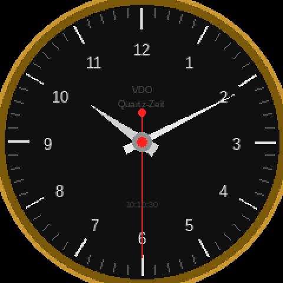

# VDO Quartz-Zeit — Waveshare ESP32-S3 Round LCD

Digitale Nachbildung der **VDO „Quartz-Zeit" Analoguhr** aus dem VW T2b, auf einem
runden Touch-Display im Cockpit. Holt optional Live-Daten vom **Spartan3-Hub**
(BLE Gateway) — kann also Uhr **und** Motordaten anzeigen.



## Hardware

| Komponente | Detail |
|---|---|
| Board | Waveshare **ESP32-S3-Touch-LCD-2.8C** (rund) |
| Display | 2.8" IPS rund, **480×480**, Controller **ST7701** (RGB-Interface) |
| Touch | **GT911** kapazitiv, I2C |
| Besonderheit | CS/RST des LCD laufen ueber **TCA9554 I2C-GPIO-Expander** (EXIO) |
| Prozessor | ESP32-S3 (LX7 Dual-Core), PSRAM (RGB-Framebuffer noetig) |
| USB | nativ USB-CDC (COM13) |

> ⚠️ **Nicht verwechseln** mit der eckigen `ESP32-S3-Touch-LCD-2.8` (240×320,
> ST7789 SPI, CST816D). Dieses Projekt ist die **runde C-Variante** (480×480, RGB).

## Software-Stack

- **LovyanGFX** — Display-Treiber (Panel_ST7701 + Bus_RGB)
- **NimBLE-Arduino** — BLE-Client zum Spartan3-Hub
- PlatformIO / Arduino-Framework

## Funktion

1. **Uhr-Modus** (Default): analoge VDO-Uhr, Hub-NTP / lokales NTP (WiFi) oder RTC
2. **Gateway-Modus** (optional): verbindet zu `Spartan3-Hub`, zeigt Live-Daten
   (Lambda, RPM, Speed, Batterie) — gleiches BLE-Payload wie der M5 Dial

## WLAN-Profile

Siehe **[docs/WLAN-MATRIX.md](docs/WLAN-MATRIX.md)** — Kurzübersicht für Home / Phone / Bus auf M5 und 2.8″.

## Zeit-Synchronisation

Priorität (bis RTC-Batterien auf Hub und Display):

1. **Hub** — wenn `hub_wifi_ok` und Hub `/api/status` liefert `ntp_synced:true` + `time_epoch` (Poll alle 300 ms, Uhr-Resync alle 60 s)
2. **Lokales NTP** — Home-WLAN mit Internet
3. **RTC / Build-Zeit** — PCF85063 oder Flash-Build-Zeit

Der Hub ist Time-Master: Phone-Hotspot → Hub-NTP → Waveshare übernimmt Hub-Zeit.

## BLE Gateway Payload (vom Spartan-Hub)

```
L<lambda>R<rpm>A<adv>M<map>V<bm6_volt>S<speed>I<123_volt>T<123_temp>C<coil>
```

Service `7f510001-5a6b-4d2a-9f20-14a7f3e20000`, Notify `...0002`.

## Status

🚧 **Bring-up.** Display-Treiber (RGB + TCA9554) wird aufgebaut. Pin-Belegung
siehe `docs/PINOUT.md` — muss gegen die echte 2.8C-Hardware verifiziert werden.

## Verwandte Projekte

- [spartan3v2-can-adapter](https://github.com/niedi74/spartan3v2-can-adapter) — der Motorraum-Hub (Datenquelle)
- m5stack-123 — M5 Dial Cockpit-Display (Schwester-Display)
